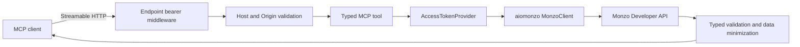

# Architecture

`monzo-mcp` separates MCP transport, upstream credential ownership, and Monzo
API behavior so the same image can support one encrypted local connection or a
stateless external broker.

## Component map

```text
src/monzo_mcp/
├── cli.py                 Human auth commands and service entrypoint
├── credentials.py         Encrypted local credential bundle
├── private_files.py       Strict private-file validation
└── mcp/
    ├── broker.py          Request-scoped broker provider
    ├── local.py           Process-owned local provider factory
    ├── context.py         Lifecycle-owned MCP dependencies
    ├── http.py            ASGI app, endpoint bearer, and Uvicorn
    ├── models.py          Data-minimized MCP contracts
    ├── runtime.py         HTTP client and provider lifecycle
    ├── server.py          FastMCP composition and transport security
    ├── settings.py        Validated environment and CLI settings
    └── tools.py           Tool definitions and safe error mapping
```

The installed `aiomonzo` package supplies the typed asynchronous Monzo client,
OAuth and provider protocols, transport, provider models, and client
exceptions. This repository owns only the MCP-specific integration around that
public dependency.

## Shared request path



The endpoint bearer is consumed before MCP tool context exists. Tools never
accept a token, user ID, arbitrary upstream URL, or credential identifier as an
argument.

## Local provider lifecycle

At startup, local mode:

1. validates and locks the credential directory;
2. reads the separate encryption key;
3. decrypts and validates the OAuth client and token bundle;
4. creates one process-wide OAuth access-token provider;
5. creates one pooled `httpx.AsyncClient`; and
6. starts the MCP listener.

Each tool call receives a lightweight reference to that provider. Refresh is
coordinated by one async lock, and replacement tokens are encrypted and
atomically persisted before the lock is released.

At shutdown, the provider forgets its OAuth client, the decrypted store state is
dropped, the filesystem lock is released, and the managed HTTP client closes.

## Broker provider lifecycle

Broker mode starts no credential store. Each tool call:

1. extracts exactly one delegation header from the current HTTP request;
2. creates a request-scoped broker provider;
3. exchanges the delegation for a usable Monzo access token;
4. creates a request-time `MonzoClient` over the shared HTTP pool;
5. makes the Monzo request;
6. performs at most one fingerprint-based retry if authentication is rejected;
7. closes the request-time client without closing the shared pool; and
8. retains no access token.

## Transport behavior

The service exposes:

- `GET`, `POST`, and protocol-required methods under `/mcp` through FastMCP's
  Streamable HTTP application; and
- unauthenticated `GET /healthz` returning only `ok`.

Read-only mode uses stateless JSON responses. Enabling write tools selects
stateful Streamable HTTP because pot movements need server-to-client
elicitation.

The server disables access logging, server banners, proxy-header trust, and
redirect following for its managed outbound client.

## Why `AccessTokenProvider` is the extension point

The asynchronous interface is intentionally small:

```python
class AccessTokenProvider(Protocol):
    async def get_access_token(self) -> str: ...

    async def refresh_after_rejection(
        self,
        rejected_access_token: str,
    ) -> str: ...
```

It separates `MonzoClient` from storage, OAuth ownership, user tenancy, and
broker format. A new provider can be implemented without changing tool schemas
or exposing credentials to the model, as long as it preserves the same
request-time and retry contract.

## Deliberately absent components

The container has no:

- database;
- Redis dependency;
- webhook listener;
- model-facing OAuth tools;
- stdio or legacy SSE transport;
- embedded multi-user identity store;
- broker implementation; or
- full MCP OAuth authorization server.

Those are not placeholders. Adding one changes the security or operational
model and requires an explicit design decision.
