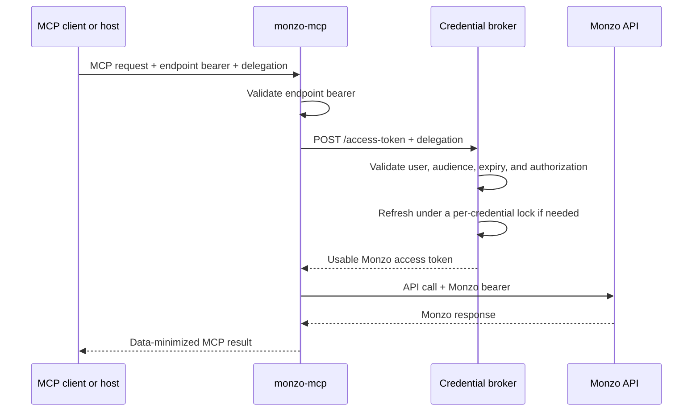

# External broker mode

Broker mode is an explicit, stateless integration for a trusted multi-user MCP
host or gateway. That host remains responsible for user identity, Monzo OAuth,
encrypted storage, refresh, and refresh locking.

Enable it with:

```text
MONZO_MCP_ACCESS_TOKEN_PROVIDER=broker
```

## Request flow



The MCP server:

- never opens a local credential bundle;
- never receives a Monzo refresh token or OAuth client secret;
- does not cache Monzo access tokens between requests;
- exchanges one delegation whenever a Monzo operation needs a token; and
- drops the access token after the request-time client is closed.

## Incoming MCP headers

The trusted host supplies two different credentials:

```http
Authorization: Bearer <mcp-endpoint-token>
X-MCP-Credential-Delegation: Bearer <short-lived-delegation>
```

The endpoint bearer authenticates access to `monzo-mcp`. Middleware validates
it in constant time and removes the `Authorization` header before the MCP tool
context is created.

The delegation authorizes one request to the private broker. It is not sent to
Monzo. Exactly one delegation header is required, and it must contain a
non-empty Bearer value no larger than 8192 bytes.

The header name can be changed with
`MONZO_MCP_DELEGATION_HEADER_NAME`, but one unambiguous organization-wide name
is preferable.

## Broker HTTP contract

For a normal tool call:

```http
POST /access-token
Authorization: Bearer <short-lived-delegation>
Accept: application/json
Content-Type: application/json

{}
```

Successful response:

```http
HTTP/1.1 200 OK
Content-Type: application/json
Cache-Control: no-store

{
  "access_token": "<usable-monzo-access-token>",
  "token_type": "Bearer",
  "expires_at": "2026-07-24T18:00:00Z"
}
```

`expires_at` may be `null` or omitted. `token_type` must be exactly `Bearer`.
Unknown fields and malformed responses are rejected.

If Monzo rejects that access token, `monzo-mcp` makes at most one retry and
sends the rejected token's SHA-256 fingerprint:

```http
POST /access-token
Authorization: Bearer <the-same-request-delegation>
Accept: application/json
Content-Type: application/json

{
  "rejected_access_token_sha256": "<lowercase-hex-sha256>"
}
```

The raw rejected token is never returned to the broker. The broker should:

1. lock the user's Monzo credential;
2. compare the fingerprint with the currently stored access token;
3. return the newer token if another request already refreshed it;
4. otherwise perform exactly one Monzo refresh;
5. atomically persist both returned tokens; and
6. return the replacement access token.

This compare-under-lock behavior prevents a stale concurrent request from
rotating Monzo's one-time refresh token a second time.

## Status contract

| Broker response | Meaning to `monzo-mcp` |
| --- | --- |
| `2xx` with the exact response schema | Use the returned access token |
| `401` or `403` | Delegation missing, invalid, expired, or unauthorized |
| `409` | The user must complete Monzo authorization again |
| Other `3xx`, `4xx`, or `5xx` | Broker unavailable |
| Timeout, connection failure, malformed JSON, or invalid schema | Broker unavailable |

Broker response bodies are not forwarded to the MCP client or model.

## Delegation requirements

The delegation format is deliberately implementation-neutral. A signed JWT,
PASETO, or opaque one-time credential is acceptable if the broker enforces:

- short expiry;
- a unique identifier or replay policy appropriate to its lifetime;
- an audience identifying the broker;
- the authenticated user or credential owner;
- the intended MCP server or integration;
- the allowed operation or narrowly scoped purpose;
- signature or reference validation;
- revocation behavior appropriate to the risk; and
- no credential values in logs, traces, metrics, or URLs.

Do not accept an unverified user ID, credential ID, or broker URL supplied in
MCP tool arguments. Authority must come from the validated delegation.

## Broker responsibilities

The broker is the sole owner of:

- Monzo OAuth login and callback handling;
- the OAuth client ID and client secret;
- encrypted access- and refresh-token storage;
- per-user authorization checks;
- refresh timing and centralized locking;
- atomic persistence of Monzo's rotated refresh token;
- reauthorization state;
- audit records that contain no credential values; and
- user-initiated revocation or disconnect.

`monzo-mcp` does not provide the broker service.

## Starting a broker-mode container

```bash
MONZO_MCP_CONFIG_DIR="$HOME/.config/monzo-mcp"
docker run --rm --name monzo-mcp \
  --network private-mcp \
  --read-only \
  --cap-drop=ALL \
  --security-opt=no-new-privileges \
  --user "$(id -u):$(id -g)" \
  --tmpfs /tmp:rw,noexec,nosuid,size=16m,mode=1777 \
  --publish 127.0.0.1:8000:8000 \
  --mount "type=bind,src=$MONZO_MCP_CONFIG_DIR/monzo-mcp-endpoint-token,dst=/run/secrets/monzo-mcp-endpoint-token,readonly" \
  --env MONZO_MCP_ACCESS_TOKEN_PROVIDER=broker \
  --env MONZO_MCP_HTTP_HOST=0.0.0.0 \
  --env MONZO_MCP_HTTP_ALLOWED_HOSTS=127.0.0.1:8000 \
  --env MONZO_MCP_TOKEN_BROKER_URL=http://credential-broker:8000/access-token \
  "$MONZO_MCP_IMAGE"
```

Use plain HTTP only on a private, controlled network. Use HTTPS and normal
service-to-service network controls whenever the broker connection crosses a
host or trust boundary.

Broker mode can be replicated because it has no local Monzo credential state,
provided every replica has the same endpoint-auth configuration and the broker
centrally serializes refresh.
